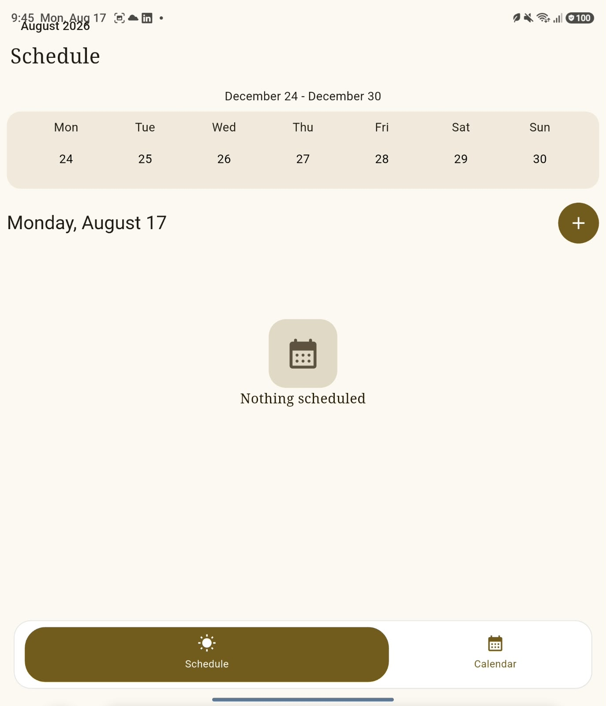

# Karsa (Scheduler & Task Manager)

A lightweight, modern Flutter scheduling and task management application designed to organize daily tasks and deliver reliable background reminders. Built with clean architecture and Material Design principles to ensure low latency and high UI responsiveness.

---

### 🌟 Key Features

* **Smart Task Scheduling:** Effortlessly create, prioritize, and manage daily schedules and deadlines.
* **Offline-First Persistence:** Relies on Hive (NoSQL local database) with TypeAdapters for fast, encrypted key-value storage and full data privacy.
* **Material Design 3 UI:** Clean, intuitive interface with light/dark mode support and crisp typography.
* **Performance Optimized:** Leverages Riverpod for reactive, performance-optimized state management with minimal UI rebuilds.

---

### 🛠️ Tech Stack & Architecture

* **Framework:** [Flutter](https://flutter.dev/) (Dart)
* **Local Storage:** Hive (NoSQL database with TypeAdapters)
* **State Management:** Flutter Riverpod
* **Design Guidelines:** Material Design 3

--- 

### Screenshot

# Different ScreenSize

